# Repository Documentation

Welcome to the comprehensive documentation for this repository. This documentation was automatically generated using AI-powered code analysis.

## Documentation Statistics

| Metric | Value |
|--------|-------|
| **Total Modules** | 1 |
| **Total Sections** | 4 |
| **Generation Time** | 53.15s |
| **Last Updated** | 6/21/2025, 12:40:21 PM |

## Repository Architecture

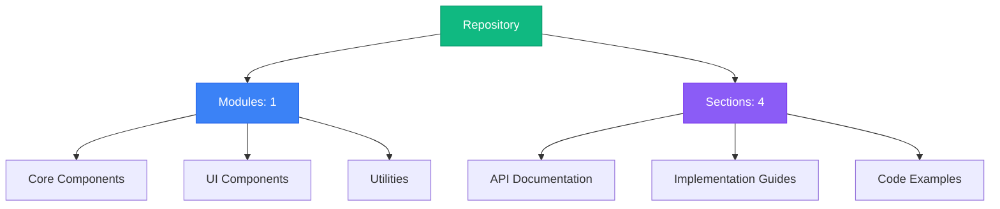

## Table of Contents

### 1. Frontend Utilities for Authentication, Data Fetching, and Time Management

No description available

**Sections:**


**1.** [Admin Approval Component: Managing Outing and Outpass Requests](#section-link-module-module_miscellaneous_utilities-section-optimized_admin_approval_component:_managing_outing_and_outpass_requests)

**2.** [Secure React Routes with `useIsAuth`: Role-Based Authentication and Redirection](#section-link-module-module_miscellaneous_utilities-section-optimized_secure_react_routes_with_`useisauth`:_role-based_authentication_and_redirection)

**3.** [`timeUtils.ts`: Formatting Dates, Times, and Durations in IST for Your Frontend](#section-link-module-module_miscellaneous_utilities-section-optimized_`timeutils.ts`:_formatting_dates,_times,_and_durations_in_ist_for_your_frontend)

**4.** [`useGetOutpasses`: Fetching and Managing Outpass Requests in React with Recoil](#section-link-module-module_miscellaneous_utilities-section-optimized_`usegetoutpasses`:_fetching_and_managing_outpass_requests_in_react_with_recoil)

---


## Navigation Guide

- **Modules**: Browse through organized code modules in the left sidebar
- **Sections**: Each module contains multiple documentation sections
- **Search**: Use the search bar to quickly find specific content
- **Headings**: Use the right sidebar to navigate within long documents
- **Actions**: Copy or download any section content using the toolbar buttons

Start exploring by selecting a module from the sidebar!


# Outing and Outpass Approval System Documentation

This document provides a comprehensive overview of the outing and outpass approval system, focusing on its architecture, workflows, usage, and implementation details. This system allows administrators to manage student requests for outings and outpasses, providing a streamlined approval or rejection process.

## System Overview

The outing and outpass approval system is a crucial part of managing student movement within an institution. It allows students to request permission for temporary absences, which administrators can then review and either approve or reject. This system ensures student safety and accountability while providing a convenient way to manage leave requests.

## Technical Architecture

The system is built using a React frontend and a Node.js/Express backend (although the backend code is not provided, its API endpoints are used). The frontend utilizes Recoil for state management and interacts with the backend via API calls to approve or reject requests.

### Component Breakdown

1.  **`frontend/src/components/approve-comp.tsx`**: This component is the main interface for administrators to view and manage outing and outpass requests. It fetches requests, filters them based on search criteria, and provides actions to approve or reject them.
2.  **`frontend/src/store.ts`**: This file defines the Recoil atoms used for global state management, including `outings`, `outpasses`, `is_authenticated`, `adminUsername`, `offCampus`, and `student`.
3.  **`frontend/src/App.tsx`**: This is the main application component that sets up routing and lazy-loads other components.
4.  **`frontend/src/layout.tsx`**: Provides the basic layout structure for the application, including the Navbar and Footer.
5.  **`frontend/src/components/Transition.tsx`**: Provides transition animations for components using `framer-motion`.
6.  **`frontend/src/components/Modal.tsx`**: A reusable modal component.
7.  **`frontend/vite.config.ts`**: Configuration file for Vite, the build tool.
8.  **`frontend/src/main.tsx`**: Entry point for the React application.
9.  **`backend/index.ts`**: Entry point for the backend server (provided for context, but not analyzed in detail).

### Component Relationships

The following diagram illustrates the relationships between the key components:

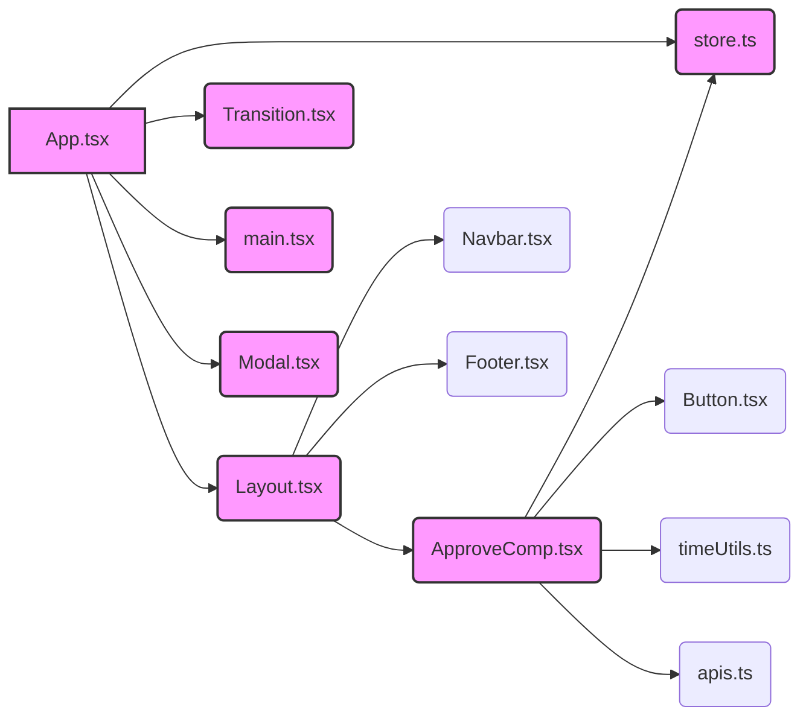

**Explanation:**

*   `App.tsx` is the root component, setting up the application's structure.
*   `Layout.tsx` provides the overall layout, including the `Navbar`, `Footer`, and the main content area.
*   `ApproveComp.tsx` is a key component for managing requests.
*   `store.ts` manages the application's global state using Recoil.
*   `Transition.tsx` provides transition animations.
*   `Modal.tsx` is a reusable modal component.
*   `main.tsx` is the entry point for the React application.

## Main Workflows and Data Flows

### 1. Approving/Rejecting Outing/Outpass Requests

This workflow describes how an administrator approves or rejects an outing or outpass request.

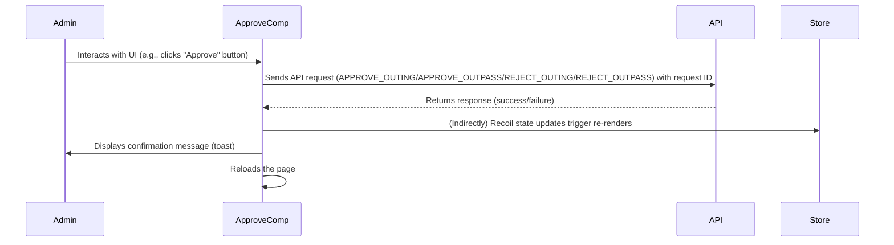

**Explanation:**

1.  The administrator interacts with the `ApproveComp` component, triggering the approval or rejection process.
2.  `ApproveComp` sends an API request to the backend to either approve or reject the request, including the request ID.
3.  The backend processes the request and returns a response.
4.  `ApproveComp` displays a confirmation message using `react-toastify`.
5.  `ApproveComp` reloads the page to reflect the changes.

**Code Example (Approving an Outing):**

```typescript
const approveouting = async (id: string) => {
    const token = localStorage.getItem('admin_token');
    const bodyData = JSON.stringify({ id });
    if (token) {
        setloading(true);
        const res = await fetch(APPROVE_OUTING, {
            method: 'POST',
            headers: {
                'Content-Type': 'application/json',
                'Authorization': `Bearer ${JSON.parse(token)}`
            },
            body: bodyData
        });
        const data = await res.json();
        setloading(false);
        toast(data.msg);
        location.reload();
    }
}
```

### 2. Filtering Requests

This workflow describes how the `ApproveComp` filters requests based on the search query.

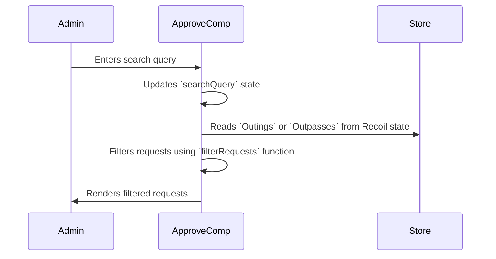

**Explanation:**

1.  The administrator enters a search query in the `ApproveComp` component.
2.  The `searchQuery` state is updated.
3.  `ApproveComp` reads the `Outings` or `Outpasses` data from the Recoil store.
4.  The `filterRequests` function filters the requests based on the `searchQuery`.
5.  The filtered requests are rendered in the UI.

**Code Example (Filtering Requests):**

```typescript
const filterRequests = (items: any[]) => {
    return items.filter(item =>
        !item.is_expired &&
        (item.username.toLowerCase().includes(searchQuery.toLowerCase()) ||
            item.email.toLowerCase().includes(searchQuery.toLowerCase()) ||
            item._id.toLowerCase().includes(searchQuery.toLowerCase()) ||
            item.reason.toLowerCase().includes(searchQuery.toLowerCase()))
    );
};
```

## How Developers Would Use This in Practice

A developer working on this system would primarily interact with the `ApproveComp` component to customize the approval process or add new features. Here are some common scenarios:

1.  **Adding a new filter criteria:** Modify the `filterRequests` function to include additional criteria for filtering requests.
2.  **Customizing the approval/rejection logic:** Modify the `approveouting`, `rejectouting`, `approveoutpass`, and `rejectoutpass` functions to include additional steps, such as sending notifications or logging actions.
3.  **Adding new fields to the request display:** Modify the JSX in `ApproveComp` to display additional fields from the request data.
4.  **Integrating with a new backend API:** Update the `APPROVE_OUTING`, `APPROVE_OUTPASS`, `REJECT_OUTING`, and `REJECT_OUTPASS` constants in `apis.ts` to point to the new API endpoints.

## Important Implementation Details and Gotchas

1.  **Authentication:** The system relies on the `admin_token` stored in `localStorage` for authentication. Ensure that this token is properly managed and secured.
2.  **Error Handling:** The `toast` function from `react-toastify` is used to display error messages. Ensure that all API calls have proper error handling to provide informative messages to the administrator.
3.  **State Management:** Recoil is used for state management. Understand how Recoil atoms and selectors work to effectively manage the application's state.
4.  **API Endpoints:** The API endpoints for approving and rejecting requests are defined in `apis.ts`. Ensure that these endpoints are correctly configured and accessible.
5.  **Page Reload:** The `location.reload()` function is used to refresh the page after an approval or rejection. This can be improved by updating the Recoil state directly instead of reloading the entire page.

## Common Issues and Troubleshooting

1.  **Requests not loading:** Check if the API endpoints are correctly configured and accessible. Verify that the `useGetOutings` and `useGetOutpasses` custom hooks are correctly fetching data.
2.  **Approval/rejection failing:** Check the network requests in the browser's developer tools to see if the API calls are failing. Verify that the `admin_token` is valid and that the backend is properly handling the requests.
3.  **Incorrect filtering:** Verify that the `filterRequests` function is correctly filtering requests based on the search criteria. Check the `searchQuery` state to ensure that it is being updated correctly.
4.  **UI not updating after approval/rejection:** Ensure that the Recoil state is being updated correctly after an approval or rejection. Consider updating the state directly instead of reloading the page.

## Advanced Configuration and Customization Options

1.  **Customizing the UI:** The `ApproveComp` component can be customized to change the look and feel of the approval interface. Use CSS or a UI library like Material UI or Ant Design to style the component.
2.  **Adding new actions:** New actions can be added to the `ApproveComp` component, such as the ability to edit requests or add comments.
3.  **Integrating with other systems:** The system can be integrated with other systems, such as a student information system or a notification system.

## Performance Considerations and Optimization Strategies

1.  **Optimize API calls:** Ensure that the API calls for fetching requests are optimized to minimize the amount of data being transferred. Use pagination or other techniques to load data in smaller chunks.
2.  **Optimize filtering:** The `filterRequests` function can be optimized to improve performance, especially when dealing with a large number of requests. Use indexing or other techniques to speed up the filtering process.
3.  **Minimize re-renders:** Use `React.memo` or other techniques to prevent unnecessary re-renders of the `ApproveComp` component.
4.  **Lazy loading:** Utilize lazy loading for components that are not immediately needed to improve initial load time.

## Security Implications and Best Practices

1.  **Authentication:** Ensure that the `admin_token` is properly secured and that only authorized administrators have access to the system.
2.  **Authorization:** Implement proper authorization checks on the backend to ensure that administrators can only approve or reject requests that they are authorized to manage.
3.  **Data validation:** Validate all data received from the client to prevent injection attacks or other security vulnerabilities.
4.  **Rate limiting:** Implement rate limiting to prevent abuse of the API endpoints.
5.  **Regular security audits:** Conduct regular security audits to identify and address any potential security vulnerabilities.

This documentation provides a comprehensive overview of the outing and outpass approval system. By understanding the architecture, workflows, usage, and implementation details, developers can effectively maintain and extend this system to meet the evolving needs of the institution.


## Authentication Hook: `useIsAuth`

This document details the `useIsAuth` custom React hook, located in `frontend/src/customhooks/is_authenticated.ts`. This hook is crucial for managing authentication state and enforcing role-based access control within the frontend application. It leverages `localStorage` for token persistence, Recoil for global state management, and React Router for navigation.

### Purpose and Importance

The `useIsAuth` hook aims to:

1.  **Check Authentication Status:** Determine if a user is currently authenticated based on the presence of tokens in `localStorage`.
2.  **Manage Authentication State:** Update the global authentication state (using Recoil) to reflect the user's authentication status and role (student or admin).
3.  **Enforce Role-Based Redirection:** Redirect unauthenticated users to the login page and authenticated users to their respective dashboards (student or admin).

This hook is essential for securing routes and ensuring that users only access the parts of the application they are authorized to use.

### Technical Architecture

The `useIsAuth` hook integrates the following technologies:

*   **React:** Provides the component lifecycle and hooks API (`useEffect`).
*   **Recoil:** Manages the global authentication state (`is_authenticated` atom).
*   **React Router:** Handles navigation between different routes (`useNavigate`).
*   **localStorage:** Persists authentication tokens across sessions.

**Component Relationships:**

*   `useIsAuth` imports `is_authenticated` from `../store`, indicating a dependency on the global authentication state defined in the `store` module.
*   `useIsAuth` utilizes `useRecoilState` from `recoil` to interact with the `is_authenticated` Recoil atom.
*   `useIsAuth` uses `useNavigate` from `react-router-dom` to programmatically redirect the user.

**Data Flow Diagram:**

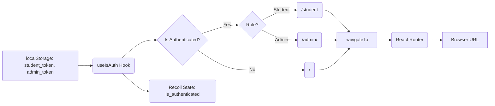

**Explanation:**

1.  The hook reads `student_token` and `admin_token` from `localStorage`.
2.  It checks if the user is authenticated based on the presence of these tokens and the current `is_authenticated` Recoil state.
3.  If authenticated, it determines the user's role based on which token is present.
4.  It redirects the user to the appropriate route using `navigateTo` from React Router.
5.  The `is_authenticated` Recoil state is updated to reflect the user's authentication status and role.

### Workflow and Data Flow

The `useIsAuth` hook executes its logic within a `useEffect` hook, ensuring it runs after the component mounts.

**Workflow: Authentication Check and Redirection**

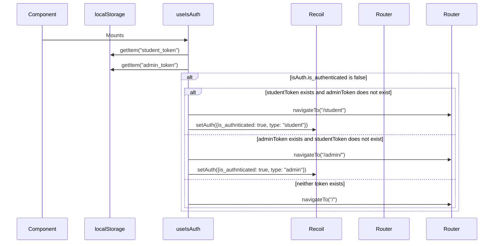

**Step-by-Step Analysis:**

1.  **Component Mounts:** The React component that uses `useIsAuth` mounts.
2.  **`useEffect` Triggered:** The `useEffect` hook within `useIsAuth` is executed.
3.  **Token Retrieval:** The hook attempts to retrieve `student_token` and `admin_token` from `localStorage`.
4.  **Authentication Check:** The hook checks if `isAuth.is_authnticated` is false.
5.  **Role-Based Redirection:**
    *   If `studentToken` exists and `adminToken` does not, the user is redirected to `/student`, and the Recoil state is updated to `{ is_authnticated: true, type: "student" }`.
    *   If `adminToken` exists and `studentToken` does not, the user is redirected to `/admin/`, and the Recoil state is updated to `{ is_authnticated: true, type: "admin" }`.
    *   If neither token exists, the user is redirected to `/`.
6.  **Navigation:** The `navigateTo` function from React Router updates the browser's URL, triggering a route change.

### Code Example

```typescript
import { useEffect } from "react";
import { is_authenticated } from "../store";
import { useRecoilState } from "recoil";
import { useNavigate } from "react-router-dom";

export function useIsAuth() {
  const [isAuth, setAuth] = useRecoilState(is_authenticated);
  const navigateTo = useNavigate();

  useEffect(() => {
    const studentToken = localStorage.getItem("student_token");
    const adminToken = localStorage.getItem("admin_token");

    if (!isAuth.is_authnticated) {
      if (studentToken && !adminToken) {
        navigateTo("/student");
        setAuth({
          is_authnticated: true,
          type: "student",
        });
      } else if (!studentToken && adminToken) {
        navigateTo("/admin/");
        setAuth({
          is_authnticated: true,
          type: "admin",
        });
      } else if (!studentToken && !adminToken) {
        navigateTo("/");
      }
    }
  }, [isAuth, navigateTo, setAuth]); // Dependencies for useEffect
}
```

### Usage Guide

To use the `useIsAuth` hook, simply import it into a React component and call it:

```typescript
import React from 'react';
import { useIsAuth } from './customhooks/is_authenticated';

function MyComponent() {
  useIsAuth(); // This will handle authentication and redirection

  return (
    <div>
      {/* Component content */}
    </div>
  );
}

export default MyComponent;
```

This will ensure that the component is protected by the authentication logic within `useIsAuth`.  The component will redirect if the user is not authenticated, or if they are authenticated as a different role.

### Implementation Details and Gotchas

*   **Dependency Array:** The `useEffect` hook's dependency array includes `isAuth`, `navigateTo`, and `setAuth`. This ensures that the effect is re-run whenever any of these values change.  Omitting these dependencies can lead to stale state and incorrect redirection behavior.
*   **Token Storage:** The hook relies on `localStorage` for token persistence.  It's important to consider the security implications of storing tokens in `localStorage`, as it is vulnerable to XSS attacks.  Consider using more secure storage mechanisms like HttpOnly cookies or the Web Crypto API for sensitive applications.
*   **Recoil State:** The `is_authenticated` Recoil atom should be initialized with a default value that reflects the initial authentication state of the application. This prevents unexpected behavior when the component first mounts.
*   **Race Conditions:**  If multiple components use `useIsAuth` and update the `is_authenticated` Recoil state, race conditions can occur.  Ensure that state updates are synchronized and consistent to avoid unexpected redirection behavior.

### Common Issues and Troubleshooting

*   **Incorrect Redirection:** If the user is redirected to the wrong page, check the following:
    *   Verify that the correct tokens are stored in `localStorage`.
    *   Ensure that the `is_authenticated` Recoil state is being updated correctly.
    *   Inspect the `useEffect` hook's dependency array to ensure that it includes all necessary dependencies.
*   **Infinite Redirection Loop:**  An infinite redirection loop can occur if the redirection logic within `useIsAuth` is triggered repeatedly.  This can happen if the `is_authenticated` Recoil state is not being updated correctly, or if there is a conflict between the redirection logic in `useIsAuth` and other parts of the application.  Carefully review the redirection logic and state updates to identify the cause of the loop.
*   **Stale State:** If the `useIsAuth` hook is not reacting to changes in `localStorage` or the `is_authenticated` Recoil state, it may be due to stale state.  Ensure that the `useEffect` hook's dependency array includes all necessary dependencies to prevent stale state.

### Advanced Configuration and Customization Options

*   **Custom Token Names:** The hook can be customized to use different token names in `localStorage`.  This can be useful if the application uses a different naming convention for authentication tokens.
*   **Custom Redirection Routes:** The hook can be configured to redirect users to different routes based on their role or authentication status.  This allows for more flexible and granular access control.
*   **Integration with Authentication APIs:** The hook can be integrated with authentication APIs to automatically refresh tokens or validate user credentials.  This can improve the security and usability of the application.

### Performance Considerations and Optimization Strategies

*   **Minimize `localStorage` Access:** Accessing `localStorage` can be a relatively slow operation.  Minimize the number of times the hook accesses `localStorage` to improve performance.  Consider caching the token values in a local variable or using a more efficient storage mechanism.
*   **Optimize Recoil State Updates:**  Updating the `is_authenticated` Recoil state can trigger re-renders of components that depend on this state.  Optimize state updates to minimize the number of re-renders.  Consider using `useRecoilValue` instead of `useRecoilState` for components that only need to read the state.
*   **Debounce Redirection:**  If the redirection logic is triggered frequently, consider debouncing the `navigateTo` function to prevent excessive navigation events.

### Security Implications and Best Practices

*   **Secure Token Storage:** As mentioned earlier, storing tokens in `localStorage` is vulnerable to XSS attacks.  Consider using more secure storage mechanisms like HttpOnly cookies or the Web Crypto API for sensitive applications.
*   **Token Validation:**  Always validate tokens on the server-side to ensure that they are valid and have not been tampered with.  Do not rely solely on the client-side authentication logic for security.
*   **Regular Token Refresh:**  Implement a mechanism for regularly refreshing tokens to prevent them from expiring.  This can improve the security and usability of the application.
*   **Prevent CSRF Attacks:**  Protect against Cross-Site Request Forgery (CSRF) attacks by implementing appropriate CSRF protection mechanisms.
*   **Input Sanitization:** Sanitize all user inputs to prevent Cross-Site Scripting (XSS) attacks.

# Time Utility Module Documentation

This document provides a comprehensive guide to the `timeUtils.ts` module, which offers a suite of functions for formatting dates, times, and calculating durations, specifically tailored for the Indian Standard Time (IST) timezone. This module is crucial for ensuring consistent and accurate time representation throughout the frontend application.

## Overview

The `timeUtils.ts` module provides several utility functions for handling date and time manipulations. These functions are designed to:

-   Format date and time strings into user-friendly formats.
-   Calculate the duration between two time points.
-   Convert date and time strings to IST.
-   Handle potential errors gracefully, providing fallback values when necessary.

This module is essential for applications that require accurate and consistent time representation, especially when dealing with users in different timezones. By centralizing time formatting and calculation logic, the module promotes code reusability and maintainability.

## Module Functions

### `formatDateTime(dateTimeString: string | undefined | null): string`

This function formats a given date and time string into a user-friendly format, specifically for the 'en-IN' locale (Indian English) and IST timezone.

**Parameters:**

-   `dateTimeString`: A string representing the date and time to be formatted. It can be `undefined` or `null`.

**Return Value:**

-   A formatted date and time string in the format `DD/MM/YYYY, hh:mm:ss AM/PM`.
-   Returns `'N/A'` if the input `dateTimeString` is `undefined` or `null`.
-   Returns `'Invalid Date'` if the input string cannot be parsed into a valid date.

**Implementation Details:**

1.  **Input Validation:** Checks if `dateTimeString` is `undefined` or `null`. If so, returns `'N/A'`.
2.  **Date Parsing:** Attempts to create a `Date` object from the input string.
3.  **Validity Check:** Checks if the created `Date` object is valid using `isNaN(date.getTime())`. If not valid, returns `'Invalid Date'`.
4.  **Formatting:** Uses `Intl.DateTimeFormat` to format the date and time into the desired format with the 'en-IN' locale and IST timezone.
5.  **Error Handling:** Catches any errors during date parsing or formatting and returns `'Invalid Date'`.

**Code Example:**

```typescript
import { formatDateTime } from './timeUtils';

const dateTime = "2024-01-01T10:30:00.000Z";
const formattedDateTime = formatDateTime(dateTime);
console.log(formattedDateTime); // Output: 01/01/2024, 04:00:00 PM
```

### `formatDate(dateString: string | undefined | null): string`

This function formats a given date string into a `DD/MM/YYYY` format, specifically for the 'en-IN' locale and IST timezone.

**Parameters:**

-   `dateString`: A string representing the date to be formatted. It can be `undefined` or `null`.

**Return Value:**

-   A formatted date string in the format `DD/MM/YYYY`.
-   Returns `'N/A'` if the input `dateString` is `undefined` or `null`.
-   Returns `'Invalid Date'` if the input string cannot be parsed into a valid date.

**Implementation Details:**

1.  **Input Validation:** Checks if `dateString` is `undefined` or `null`. If so, returns `'N/A'`.
2.  **Date Parsing:** Attempts to create a `Date` object from the input string.
3.  **Validity Check:** Checks if the created `Date` object is valid using `isNaN(date.getTime())`. If not valid, returns `'Invalid Date'`.
4.  **Formatting:** Uses `Intl.DateTimeFormat` to format the date into the `DD/MM/YYYY` format with the 'en-IN' locale and IST timezone.
5.  **Error Handling:** Catches any errors during date parsing or formatting and returns `'Invalid Date'`.

**Code Example:**

```typescript
import { formatDate } from './timeUtils';

const date = "2024-01-01";
const formattedDate = formatDate(date);
console.log(formattedDate); // Output: 01/01/2024
```

### `formatTime(timeString: string | undefined | null): string`

This function formats a given time string into a `hh:mm AM/PM` format, specifically for the 'en-IN' locale and IST timezone.

**Parameters:**

-   `timeString`: A string representing the time to be formatted. It can be `undefined` or `null`.

**Return Value:**

-   A formatted time string in the format `hh:mm AM/PM`.
-   Returns `'N/A'` if the input `timeString` is `undefined` or `null`.
-   Returns `'Invalid Time'` if the input string cannot be parsed into a valid time.

**Implementation Details:**

1.  **Input Validation:** Checks if `timeString` is `undefined` or `null`. If so, returns `'N/A'`.
2.  **Date Parsing:** Attempts to create a `Date` object from the input string.
3.  **Validity Check:** Checks if the created `Date` object is valid using `isNaN(date.getTime())`. If not valid, returns `'Invalid Time'`.
4.  **Formatting:** Uses `Intl.DateTimeFormat` to format the time into the `hh:mm AM/PM` format with the 'en-IN' locale and IST timezone.
5.  **Error Handling:** Catches any errors during date parsing or formatting and returns `'Invalid Time'`.

**Code Example:**

```typescript
import { formatTime } from './timeUtils';

const time = "2024-01-01T10:30:00";
const formattedTime = formatTime(time);
console.log(formattedTime); // Output: 10:30 AM
```

### `calculateDuration(startTime: string, endTime: string): Duration`

This function calculates the duration between two given time points. It handles both time-only strings (for outings) and full date strings (for outpasses).

**Parameters:**

-   `startTime`: A string representing the start time.
-   `endTime`: A string representing the end time.

**Return Value:**

-   An object of type `Duration` with the following properties:
    -   `days`: Number of days between the start and end dates.
    -   `hours`: Number of hours between the start and end times.
    -   `minutes`: Number of minutes between the start and end times.
    -   `seconds`: Number of seconds between the start and end times.
-   Returns `{ days: 'NaN', hours: 'NaN', minutes: 'NaN', seconds: 'NaN' }` if either `startTime` or `endTime` is `undefined`, `null`, or invalid.

**Implementation Details:**

1.  **Input Validation:** Checks if `startTime` or `endTime` is `undefined` or `null`. If so, returns a `Duration` object with all properties set to `'NaN'`.
2.  **Time-Only String Handling (Outings):**
    -   If `startTime` includes `'am'` or `'pm'`, it's treated as a time-only string.
    -   The `parseTime` helper function converts the 12-hour time format to seconds since midnight.
    -   The difference in seconds between `endTime` and `startTime` is calculated.
    -   The duration is calculated in terms of hours, minutes, and seconds.
3.  **Full Date String Handling (Outpasses):**
    -   If `startTime` does not include `'am'` or `'pm'`, it's treated as a full date string in `DD/MM/YYYY` format.
    -   The date strings are split into day, month, and year components.
    -   `Date` objects are created from the start and end dates.
    -   The difference in milliseconds between the end and start dates is calculated.
    -   The duration is calculated in terms of days, hours, minutes, and seconds.
4.  **Error Handling:** Catches any errors during date parsing or calculation and returns a `Duration` object with all properties set to `'NaN'`.

**Code Example:**

```typescript
import { calculateDuration } from './timeUtils';

const outingStartTime = "10:00 am";
const outingEndTime = "12:30 pm";
const outingDuration = calculateDuration(outingStartTime, outingEndTime);
console.log(outingDuration); // Output: { days: 0, hours: 2, minutes: 30, seconds: 0 }

const outpassStartDate = "01/01/2024";
const outpassEndDate = "03/01/2024";
const outpassDuration = calculateDuration(outpassStartDate, outpassEndDate);
console.log(outpassDuration); // Output: { days: 2, hours: 0, minutes: 0, seconds: 0 }
```

**Mermaid Diagram:**

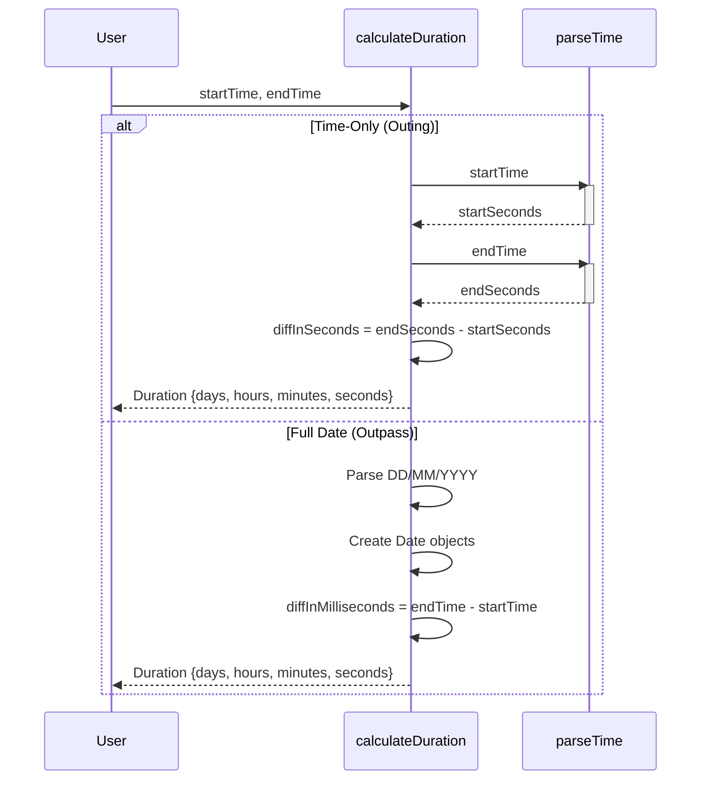

*Explanation: This sequence diagram illustrates the two main paths within the `calculateDuration` function: one for time-only strings (outings) and another for full date strings (outpasses). It shows how the `parseTime` helper function is used to convert time strings into seconds, and how date strings are parsed to create `Date` objects for duration calculation.*

### `convertToIST(dateTimeString: string): string`

This function converts a given date and time string to the Indian Standard Time (IST) timezone.

**Parameters:**

-   `dateTimeString`: A string representing the date and time to be converted.

**Return Value:**

-   A date and time string in IST, formatted as `DD/MM/YYYY, hh:mm:ss AM/PM`.
-   Returns `'N/A'` if the input `dateTimeString` is `undefined` or `null`.
-   Returns the original `dateTimeString` if parsing fails or if it's already in the correct time-only format.

**Implementation Details:**

1.  **Input Validation:** Checks if `dateTimeString` is `undefined` or `null`. If so, returns `'N/A'`.
2.  **Time-Only Format Check:** Checks if the input string is already in the correct time-only format (e.g., `"10:30:00 am"`). If so, returns the original string.
3.  **Date Parsing:** Attempts to create a `Date` object from the input string.
4.  **Validity Check:** Checks if the created `Date` object is valid using `isNaN(date.getTime())`. If not valid, returns the original `dateTimeString`.
5.  **Conversion and Formatting:** Uses `toLocaleString` to convert the date and time to IST and format it as `DD/MM/YYYY, hh:mm:ss AM/PM`.
6.  **Error Handling:** Catches any errors during date parsing or formatting and returns the original `dateTimeString`.

**Code Example:**

```typescript
import { convertToIST } from './timeUtils';

const utcDateTime = "2024-01-01T10:30:00.000Z";
const istDateTime = convertToIST(utcDateTime);
console.log(istDateTime); // Output: 01/01/2024, 04:00:00 PM

const alreadyIST = "10:30:00 am";
const convertedIST = convertToIST(alreadyIST);
console.log(convertedIST); // Output: 10:30:00 am
```

### `formatDuration(duration: Duration): string`

This function formats a `Duration` object into a human-readable string.

**Parameters:**

-   `duration`: A `Duration` object with `days`, `hours`, `minutes`, and `seconds` properties.

**Return Value:**

-   A formatted duration string, such as `"2 days, 3 hours, 30 minutes"`.
-   Returns `'Invalid Duration'` if any of the `duration` properties are `'NaN'`.
-   Returns `'0 seconds'` if all duration components are zero.

**Implementation Details:**

1.  **Input Validation:** Checks if any of the `duration` properties are `'NaN'`. If so, returns `'Invalid Duration'`.
2.  **Component Formatting:** Creates an array of string parts, each representing a duration component (days, hours, minutes, seconds).
3.  **String Concatenation:** Joins the string parts with commas to create the final formatted duration string.
4.  **Zero Duration Handling:** If no duration components are present (all are zero), returns `'0 seconds'`.

**Code Example:**

```typescript
import { formatDuration } from './timeUtils';

const duration = { days: 2, hours: 3, minutes: 30, seconds: 0 };
const formattedDuration = formatDuration(duration);
console.log(formattedDuration); // Output: 2 days, 3 hours, 30 minutes

const zeroDuration = { days: 0, hours: 0, minutes: 0, seconds: 0 };
const formattedZeroDuration = formatDuration(zeroDuration);
console.log(formattedZeroDuration); // Output: 0 seconds
```

### `formatRequestTime(dateTimeString: string): string`

This function formats a specific date and time string, typically used for request times, into a user-friendly format, adding 5 hours and 30 minutes for IST conversion.

**Parameters:**

-   `dateTimeString`: A string representing the date and time to be formatted, expected in the format `"DD/MM/YYYY, h:mm:ss am/pm"`.

**Return Value:**

-   A formatted date and time string in the format `DD/MM/YYYY, hh:mm AM/PM` (IST).
-   Returns the original `dateTimeString` if parsing fails.

**Implementation Details:**

1.  **Input Parsing:** Splits the input string into date and time parts.
2.  **Manual Date Parsing:** Parses the date part (`DD/MM/YYYY`) into day, month, and year components.
3.  **Time Parsing:** Uses the `parseTime` helper function to parse the time part (`h:mm:ss am/pm`) into hour, minute, and second components.
4.  **Date Object Creation:** Creates a `Date` object from the parsed date and time components. Note that JavaScript months are 0-based, so the month is decremented by 1.
5.  **IST Conversion:** Adds 5 hours and 30 minutes (330 minutes) to the `Date` object to convert it to IST.
6.  **Formatting:** Uses `toLocaleString` to format the date and time into the desired format with the 'en-IN' locale.
7.  **Error Handling:** Catches any errors during parsing or formatting and returns the original `dateTimeString`.

**Code Example:**

```typescript
import { formatRequestTime } from './timeUtils';

const requestTime = "18/2/2025, 3:41:23 am";
const formattedRequestTime = formatRequestTime(requestTime);
console.log(formattedRequestTime); // Output: 18/02/2025, 09:11 AM (approximately)
```

### `parseTime(timeString: string): number[]` (Helper Function)

This helper function converts a time string in `"h:mm:ss am/pm"` format into an array of numbers representing the hour, minute, and second.

**Parameters:**

-   `timeString`: A string representing the time in `"h:mm:ss am/pm"` format.

**Return Value:**

-   An array of numbers `[hour, minute, second]`.

**Implementation Details:**

1.  **String Splitting:** Splits the input string into time and modifier (am/pm) parts.
2.  **Time Component Parsing:** Splits the time part into hour, minute, and second components and converts them to numbers.
3.  **12-Hour to 24-Hour Conversion:** Adjusts the hour based on the am/pm modifier.
4.  **Return Value:** Returns the array of numbers `[hour, minute, second]`.

**Code Example:**

```typescript
import { parseTime } from './timeUtils';

const timeString = "3:41:23 am";
const parsedTime = parseTime(timeString);
console.log(parsedTime); // Output: [ 3, 41, 23 ]
```

## Data Flows

The `timeUtils.ts` module is a dependency-free utility module, meaning it does not rely on any other modules within the project. Its functions are designed to be self-contained and reusable across different components.

**Data Flow Diagram:**


*Explanation: This diagram illustrates the general data flow. A component imports functions from `timeUtils.ts`, passes in a date/time string or duration, and receives a formatted string or calculated duration in return.*

## Integration Points

The `timeUtils.ts` module is integrated into various components throughout the frontend application, including:

-   `frontend/src/pages/student.tsx`: For displaying and formatting student-related dates and times.
-   `frontend/src/components/requestCard.tsx`: For calculating and displaying the duration of outpass/outing requests.
-   `frontend/src/components/sidebar.tsx`: No direct usage, but indirectly used by components rendered within the sidebar.
-   `frontend/src/pages/GradeHub.tsx`: No direct usage.
-   `frontend/src/pages/Attendance.tsx`: No direct usage.

## Usage Guide

To use the `timeUtils.ts` module in your component:

1.  **Import the desired function:**

    ```typescript
    import { formatDateTime, calculateDuration } from './timeUtils';
    ```

2.  **Call the function with the appropriate parameters:**

    ```typescript
    const myDateTime = "2024-01-01T12:00:00Z";
    const formatted = formatDateTime(myDateTime);
    console.log(formatted); // Output: 01/01/2024, 05:30:00 PM

    const duration = calculateDuration("10:00 am", "12:00 pm");
    console.log(duration); // Output: { days: 0, hours: 2, minutes: 0, seconds: 0 }
    ```

## Implementation Details and Gotchas

-   **Timezone Handling:** All formatting functions are specifically configured for the IST timezone. Ensure that your input date and time strings are either in UTC or already in IST for accurate conversion.
-   **Date Parsing:** The `Date` object in JavaScript can be sensitive to the format of the input string. It's recommended to use ISO 8601 format (`YYYY-MM-DDTHH:mm:ss.sssZ`) for consistent parsing.
-   **`Intl.DateTimeFormat`:** This API relies on the user's browser and operating system for locale data. While 'en-IN' is generally supported, ensure that your target audience has the necessary locale data installed.
-   **`calculateDuration`:** This function makes assumptions about the format of the input strings. Ensure that your time-only strings include `'am'` or `'pm'` and that your full date strings are in `DD/MM/YYYY` format.

## Common Issues and Troubleshooting

-   **Incorrect Timezone:** If the formatted date and time are not in IST, double-check that the `timeZone` option in `Intl.DateTimeFormat` is set to `'Asia/Kolkata'`.
-   **`Invalid Date`:** If you're getting `'Invalid Date'` as output, the input string is likely not a valid date format. Try using ISO 8601 format or ensure that your date string matches the expected format.
-   **`NaN` Duration:** If you're getting `'NaN'` values in the `Duration` object, the input strings to `calculateDuration` are likely `undefined`, `null`, or in an unexpected format.

## Security Implications and Best Practices

-   **Input Validation:** Always validate input date and time strings to prevent unexpected behavior or errors.
-   **Timezone Awareness:** Be mindful of timezones when storing and processing date and time data. Store dates and times in UTC and convert to the user's local timezone for display.
-   **Error Handling:** Implement robust error handling to gracefully handle invalid date and time strings.

## Advanced Configuration and Customization Options

-   **Custom Formats:** You can customize the date and time formats by modifying the options passed to `Intl.DateTimeFormat`. Refer to the [MDN documentation](https://developer.mozilla.org/en-US/docs/Web/JavaScript/Reference/Global_Objects/Intl/DateTimeFormat/DateTimeFormat) for available options.
-   **Different Locales:** You can support different locales by changing the locale string passed to `Intl.DateTimeFormat`.
-   **Duration Formatting:** You can customize the duration formatting in `formatDuration` by modifying the string parts and concatenation logic.

## Performance Considerations and Optimization Strategies

-   **`Intl.DateTimeFormat` Caching:** Creating `Intl.DateTimeFormat` objects can be expensive. Cache these objects and reuse them whenever possible.
-   **String Manipulation:** String manipulation can be performance-intensive. Use efficient string manipulation techniques and avoid unnecessary string concatenation.

## Component Relationships

The `timeUtils.ts` module is a utility module and does not depend on any other modules. However, it is used by several components in the frontend application.

**Dependency Chain:**

```
[Components] --> timeUtils.ts
```

## Workflow Visualization

The following diagram illustrates the workflow of formatting a date and time string using the `formatDateTime` function:

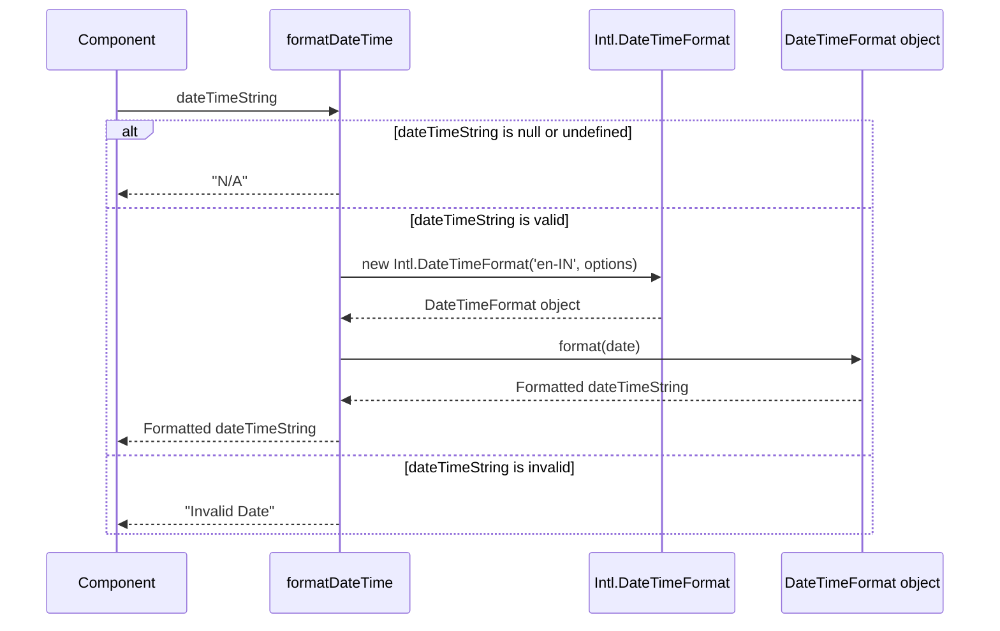

*Explanation: This sequence diagram shows the steps involved in formatting a date and time string. It covers the cases where the input is null/undefined, valid, or invalid, and shows the interaction with the `Intl.DateTimeFormat` API.*

This documentation provides a comprehensive overview of the `timeUtils.ts` module, its functions, and its integration into the frontend application. By following this guide, developers can effectively use the module to ensure consistent and accurate time representation throughout the application.


## Uni-Z Outpass and Outing Request System: Technical Documentation

This document provides a comprehensive technical overview of the Uni-Z outpass and outing request system. It covers the system's architecture, workflows, security considerations, and practical usage for developers.

### System Overview

The Uni-Z system manages student outpass and outing requests, including submission, approval, rejection, and tracking. It comprises a React-based frontend and a Node.js/Express backend with a Prisma ORM for database interactions. The system uses JWT for authentication and Recoil for frontend state management. Email notifications are integrated to inform students and wardens about request status changes.

### Technical Architecture

The system follows a layered architecture:

1.  **Frontend (React/Typescript):** Handles user interface, request submission, and data display. Uses Recoil for state management and interacts with the backend via API calls.
2.  **Backend (Node.js/Express):** Exposes REST APIs for the frontend. Implements authentication, authorization, request processing, and database interactions.
3.  **Database (Prisma):** Provides a type-safe interface for interacting with the database (likely PostgreSQL, though not explicitly specified).
4.  **Email Service (Nodemailer):** Sends email notifications for various events, such as request submission, approval, and rejection.

#### Component Relationships

The following diagram illustrates the relationships between key components:

```mermaid
graph LR
    FE[Frontend (React)] --> BE(Backend (Express));
    BE --> DB(Database (Prisma));
    BE --> Email(Email Service (Nodemailer));
    BE --> Auth(Authentication (JWT));
    FE --> Auth;
    style FE fill:#f9f,stroke:#333,stroke-width:2px
    style BE fill:#ccf,stroke:#333,stroke-width:2px
    style DB fill:#ffc,stroke:#333,stroke-width:2px
    style Email fill:#cff,stroke:#333,stroke-width:2px
    style Auth fill:#cfc,stroke:#333,stroke-width:2px
```

**Explanation:**

*   The Frontend interacts with the Backend via API requests.
*   The Backend uses Prisma to interact with the Database.
*   The Backend sends emails via Nodemailer.
*   Both Frontend and Backend use JWT for authentication.

### Data Flow

Data flows through the system in the following manner:

1.  **Student Request:** A student submits an outpass or outing request via the frontend.
2.  **API Call:** The frontend sends an API request to the backend with the request details.
3.  **Authentication/Authorization:** The backend authenticates the student using JWT and authorizes the request.
4.  **Data Validation:** The backend validates the request data.
5.  **Database Interaction:** The backend uses Prisma to store the request in the database.
6.  **Email Notification:** The backend sends an email notification to the student and warden.
7.  **Admin Approval/Rejection:** An admin approves or rejects the request via the admin interface (likely another part of the frontend).
8.  **Database Update:** The backend updates the request status in the database.
9.  **Email Notification:** The backend sends an email notification to the student about the approval or rejection.
10. **Frontend Update:** The frontend fetches the updated request status and displays it to the student.

### Main Workflows

#### 1. Fetching Outpass Requests (Admin)

This workflow describes how an admin retrieves outpass requests.

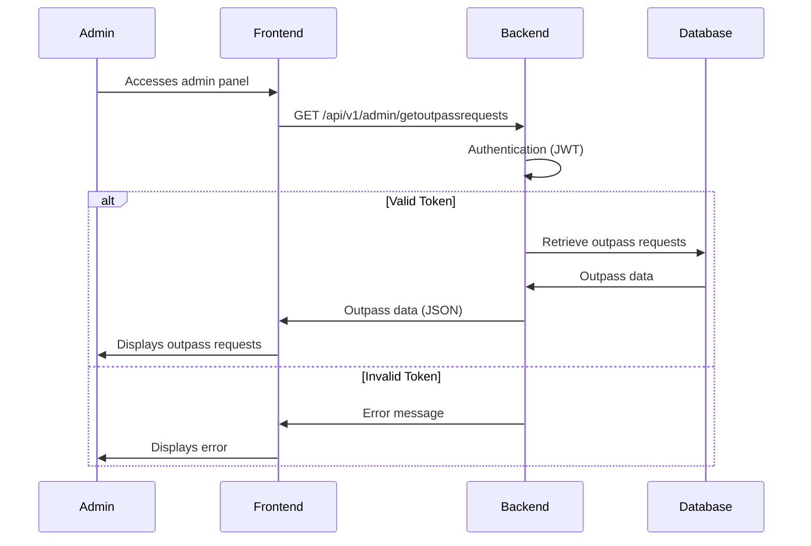

**Explanation:**

1.  The admin accesses the admin panel in the frontend.
2.  The frontend sends a GET request to the `/api/v1/admin/getoutpassrequests` endpoint on the backend.
3.  The backend authenticates the request using JWT.
4.  If the token is valid, the backend retrieves outpass requests from the database using Prisma.
5.  The backend sends the outpass data to the frontend as a JSON response.
6.  The frontend displays the outpass requests to the admin.
7.  If the token is invalid, the backend sends an error message to the frontend, which displays it to the admin.

**Code Example (Frontend - `getoutpassess.tsx`):**

```typescript
import { useEffect } from "react";
import { useSetRecoilState } from "recoil";
import { outpasses } from "../store";
import { GET_OUTPASS_REQUESTS } from "../apis";

export function useGetOutpasses(){
    const setOutpasses = useSetRecoilState(outpasses);
    useEffect(()=>{
        const token = localStorage.getItem('admin_token');
        if(token){
            const getDetails = async()=>{
                const res = await fetch(GET_OUTPASS_REQUESTS,{
                    method : 'GET',
                    headers : {
                        'Content-Type' : 'application/json',
                        'Authorization' : `Bearer ${JSON.parse(token)}`
                    },
                });
                const data = await res.json();
                setOutpasses(data.outpasses)
            }
            getDetails();
        }
    },[])
}
```

**Explanation:**

*   This custom hook `useGetOutpasses` fetches outpass requests from the backend.
*   It retrieves the admin token from local storage.
*   It makes a GET request to the `GET_OUTPASS_REQUESTS` API endpoint, including the token in the `Authorization` header.
*   It parses the JSON response and updates the `outpasses` Recoil state with the fetched data.

**Code Example (Backend - `admin.ts`):**

```typescript
import { Router } from "express";
import jwt from "jsonwebtoken";
import { v4 as uuidv4 } from 'uuid';
import { PrismaClient } from "@prisma/client";
import { fetchAdmin, validateSigninInputs } from "./middlewares/middlewares";
import { authMiddleware, validateResetPassInputs } from "../student/middlewares/middlewares";
const client = new PrismaClient();
import {
  addStudent,

  convertLetterToNumericGrade,
 
  getStudentDetails,
  getUsers,

  subjectsData,
  updateAdminPassword,
  validateInput,
  validateInputForAttendance,
} from "../helper-functions";
export const adminRouter = Router();

// //  ----------------------------------------------------------------------------------   //  Outpass and Outing Approvals  ----------------------------------------------------------------------------------   //
// adminRouter.get("/getoutpassrequests", authMiddleware, async (req, res) => {
//   try {
//     const requests = await getOutPassRequests();
//     res.json({ outpasses: requests, success: true });
//   } catch (e) {
//     res.json({ msg: "Error : Fething requests Try again!", success: true });
//   }
// });
```

**Explanation:**
This code snippet shows the commented-out route handler for `/getoutpassrequests`.  It's likely intended to fetch outpass requests from the database and return them as a JSON response. The `authMiddleware` ensures that only authenticated admins can access this endpoint.

#### 2. Student Requesting an Outpass

This workflow details the process of a student requesting an outpass.

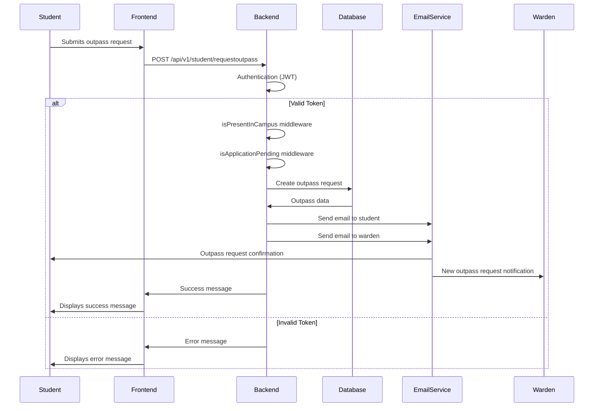

**Explanation:**

1.  The student submits an outpass request through the frontend.
2.  The frontend sends a POST request to the `/api/v1/student/requestoutpass` endpoint on the backend.
3.  The backend authenticates the request using JWT.
4.  The `isPresentInCampus` middleware verifies the student's presence on campus.
5.  The `isApplicationPending` middleware checks for any pending requests from the student.
6.  The backend creates a new outpass request in the database using Prisma.
7.  The backend sends email notifications to the student and warden using Nodemailer.
8.  The backend sends a success message to the frontend.
9.  The frontend displays the success message to the student.
10. If the token is invalid, the backend sends an error message to the frontend, which displays it to the student.

**Code Example (Backend - `student.ts`):**

```typescript
studentRouter.post('/requestoutpass', isPresentInCampus, isApplicationPending, authMiddleware, async (req, res) => {
    const { reason, userId, from_date, to_date } = req.body;
    try {
        const outpass = await requestOutpass(reason, userId, new Date(from_date), new Date(to_date));
        if (outpass?.success) {
            const user = await client.student.findFirst({ where: { id: userId }, select: { Email: true, Username: true } });
            const studentOutpassEmail = await getOutpassMailFormatForStudent(outpass);
            const wardenOutpassEmail = await getOutpassMailFormatForWarden(outpass, user);
            if (user?.Email) {
                await sendEmail(user.Email, "Regarding your OutpassRequest", studentOutpassEmail);
                await sendEmail('sreecharan309@gmail.com', `New Outpass Request From ${user.Username}`, wardenOutpassEmail);
            }
            res.json({ msg: outpass.msg, success: outpass.success });
        } else {
            res.json({ msg: outpass?.msg, success: outpass?.success });
        }
    } catch (error) {
        console.error("Error requesting outpass:", error);
        res.status(500).json({ msg: "An unexpected error occurred. Please try again later.", success: false });
    }
});
```

**Explanation:**

*   This route handler handles the `/requestoutpass` endpoint.
*   It uses the `isPresentInCampus`, `isApplicationPending`, and `authMiddleware` middlewares for validation and authentication.
*   It calls the `requestOutpass` function (defined in `helper-functions.ts`) to create the outpass request in the database.
*   It retrieves the student's email and username from the database.
*   It generates email bodies for the student and warden using `getOutpassMailFormatForStudent` and `getOutpassMailFormatForWarden` (defined in `emails.ts`).
*   It sends email notifications to the student and warden using the `sendEmail` function (not shown, but likely defined in `helper-functions.ts`).
*   It sends a JSON response with a success message or an error message.

#### 3. Admin Authentication

This workflow describes how an admin authenticates and receives a JWT token.

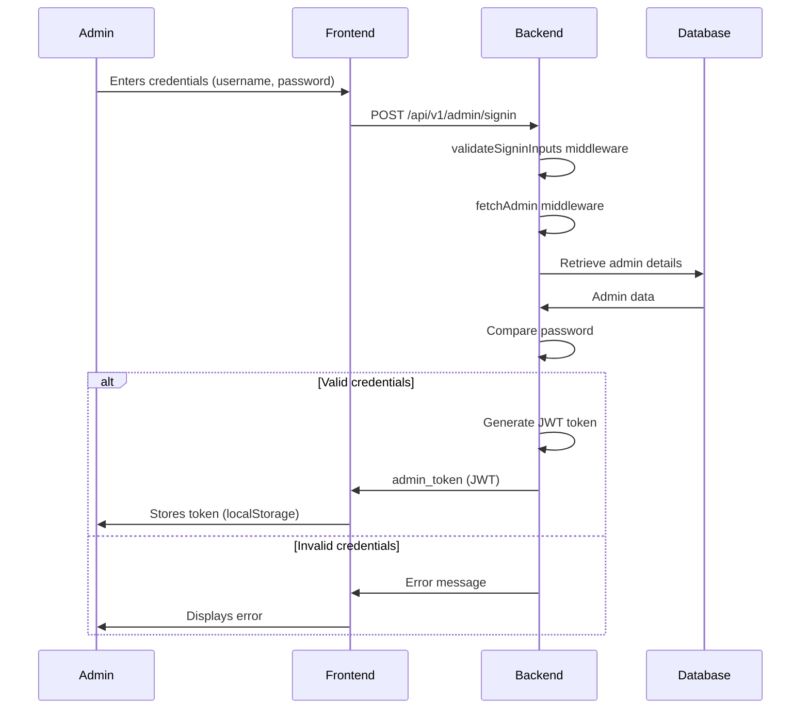

**Explanation:**

1.  The admin enters their username and password in the frontend.
2.  The frontend sends a POST request to the `/api/v1/admin/signin` endpoint on the backend.
3.  The `validateSigninInputs` middleware validates the username and password.
4.  The `fetchAdmin` middleware retrieves the admin details from the database.
5.  The backend compares the entered password with the hashed password stored in the database.
6.  If the credentials are valid, the backend generates a JWT token.
7.  The backend sends the JWT token to the frontend as a JSON response.
8.  The frontend stores the token in local storage.
9.  If the credentials are invalid, the backend sends an error message to the frontend, which displays it to the admin.

**Code Example (Backend - `admin.ts`):**

```typescript
adminRouter.post("/signin", validateSigninInputs, fetchAdmin, async (req, res) => {
  try {
    const { username } = req.body;
    if (!process.env.JWT_SECURITY_KEY) throw new Error("JWT_SECURITY_KEY is not defined");
    const token = jwt.sign(username, process.env.JWT_SECURITY_KEY);
    res.json({ admin_token: token, success: true });
  } catch (e) {
    res.json({ msg: "Internal Server Error Please Try again!", success: false });
  }
});
```

**Explanation:**

*   This route handler handles the `/signin` endpoint.
*   It uses the `validateSigninInputs` and `fetchAdmin` middlewares for validation and authentication.
*   It retrieves the username from the request body.
*   It generates a JWT token using the `jwt.sign` function, signing the username with the `JWT_SECURITY_KEY` environment variable.
*   It sends a JSON response with the JWT token and a success message.

### Code Examples and Usage

#### 1. Input Component (`input.tsx`)

```typescript
import { useState } from "react";

type InputProps = {
    type: string,
    placeholder: string,
    onchangeFunction: React.ChangeEventHandler<HTMLInputElement> | undefined,
}

export function Input({ type, placeholder, onchangeFunction }: InputProps) {
    const [passwordVisible, setPasswordVisible] = useState(false);
    const togglePasswordVisibility = () => {
        setPasswordVisible(!passwordVisible);
    };

    if (type === "password") {
        return (
            <div className="flex items-center space-x-2 w-full">
                <input
                    type={passwordVisible ? "text" : "password"}
                    placeholder={placeholder}
                    className="px-4 py-2 rounded-l border w-full focus:outline-none"
                    onChange={onchangeFunction}
                />
                <button
                    className="bg-gray-200 hover:bg-gray-300 text-gray-700 font-semibold py-2 px-4 rounded-r"
                    onClick={togglePasswordVisibility}
                >
                    {passwordVisible ? "Hide" : "Show"}
                </button>
            </div>
        );
    }
    return (
        <input
            type={type}
            placeholder={placeholder}
            className="px-4 py-2 rounded border w-full focus:outline-none"
            onChange={onchangeFunction}
        />
    );
}
```

**Usage:**

```typescript
<Input
    type="password"
    placeholder="Enter your password"
    onchangeFunction={(e) => setPassword(e.target.value)}
/>
<Input
    type="text"
    placeholder="Enter your username"
    onchangeFunction={(e) => setUsername(e.target.value)}
/>
```

**Explanation:**

*   This component creates a reusable input field.
*   It accepts `type`, `placeholder`, and `onchangeFunction` as props.
*   If the `type` is "password", it renders a password input field with a "Show/Hide" button to toggle password visibility.
*   Otherwise, it renders a standard input field.

#### 2. API Endpoints (`apis.ts`)

```typescript
export const GET_OUTING_REQUESTS = 'https://uni-z-api.vercel.app/api/v1/admin/getoutingrequests';
export const GET_OUTPASS_REQUESTS = 'https://uni-z-api.vercel.app/api/v1/admin/getoutpassrequests'
export const STUDENT_OUTSIDE_CAMPUS = 'https://uni-z-api.vercel.app/api/v1/admin/getstudentsoutsidecampus'
export const STUDENT_INFO = "https://uni-z-api.vercel.app/api/v1/student/getdetails";
export const APPROVE_OUTING = "https://uni-z-api.vercel.app/api/v1/admin/approveouting";
export const REJECT_OUTING = "https://uni-z-api.vercel.app/api/v1/admin/rejectouting";
export const APPROVE_OUTPASS = "https://uni-z-api.vercel.app/api/v1/admin/approveoutpass"
export const REJECT_OUTPASS = "https://uni-z-api.vercel.app/api/v1/admin/rejectoutpass"
export const REQUEST_OUTING = "https://uni-z-api.vercel.app/api/v1/student/requestouting"
export const REQUEST_OUTPASS = "https://uni-z-api.vercel.app/api/v1/student/requestoutpass"
export const RESET_PASS = "https://uni-z-api.vercel.app/api/v1/student/resetpass"
export const SEARCH_STUDENTS = "https://uni-z-api.vercel.app/api/v1/admin/searchstudent";
export const UPDATE_STUDENT_STATUS = "https://uni-z-api.vercel.app/api/v1/admin/updatestudentstatus";
```

**Explanation:**

*   This file defines constants for API endpoints used by the frontend.
*   It provides a centralized location for managing API URLs, making it easier to update them if the backend changes.

#### 3. Student Middleware (`middlewares.ts`)

```typescript
export const validateSigninInputs = async (req: Request, res: Response, next: NextFunction) => {
  const { username, password } = req.body;
  const zodUsernameSchema = zod.string().min(7, "Your username should contain minimum 7 characters").max(7, "Your username should contain maximum 7 characters");
  const zodPasswordSchema = zod.string().min(8, "Your password should contain minimum 8 characters").max(20, "Your password should contain maximum 20 characters");

  const isUsernameValidated = zodUsernameSchema.safeParse(username);
  const isPasswordValidated = zodPasswordSchema.safeParse(password);

  if (!isUsernameValidated.success || !isPasswordValidated.success) 
    return res.json({ 
      msg: !isUsernameValidated.success && !isPasswordValidated.success 
        ? `${isUsernameValidated.error?.issues[0].message} and ${isPasswordValidated.error?.issues[0].message}` 
        : isUsernameValidated.error?.issues[0].message || isPasswordValidated.error?.issues[0].message, 
      success: false 
    });
    console.log("Validated Signin Inputs");
  next();
};
```

**Explanation:**

*   This middleware function validates the username and password inputs during student sign-in.
*   It uses the `zod` library for schema validation.
*   It checks if the username is 7 characters long and the password is between 8 and 20 characters long.
*   If the inputs are invalid, it sends a JSON response with an error message.
*   If the inputs are valid, it calls the `next()` function to pass control to the next middleware or route handler.

### Important Implementation Details and Gotchas

*   **JWT Security:** Ensure the `JWT_SECURITY_KEY` environment variable is securely managed and never exposed.
*   **Password Hashing:** Use a strong hashing algorithm (e.g., bcrypt) with a high salt factor to protect user passwords.
*   **Email Sending:** Implement proper error handling and logging for email sending to ensure reliable delivery. Consider using a dedicated email service provider for better deliverability.
*   **Input Validation:** Thoroughly validate all user inputs to prevent security vulnerabilities such as SQL injection and cross-site scripting (XSS).
*   **Date Handling:** Be mindful of time zones when handling dates and times, especially for outpass and outing requests.
*   **Recoil State Management:** Understand the principles of Recoil for efficient state management in the frontend. Avoid unnecessary state updates to optimize performance.
*   **Prisma Client:** Properly configure and manage the Prisma client to ensure efficient database connections and queries.

### Common Issues and Troubleshooting

*   **Authentication Errors:** Verify that the JWT token is correctly generated, stored, and included in API requests. Check the `JWT_SECURITY_KEY` environment variable.
*   **Database Connection Errors:** Ensure that the database server is running and accessible. Check the Prisma connection string in the `.env` file.
*   **Email Sending Errors:** Check the Nodemailer configuration and verify that the email service provider is properly configured. Review email logs for any errors.
*   **Frontend Rendering Issues:** Use the React Developer Tools to inspect the component tree and identify any rendering errors or performance bottlenecks.
*   **Middleware Errors:** Carefully review the middleware logic and ensure that the `next()` function is called correctly to pass control to the next handler.

### Advanced Configuration and Customization Options

*   **Customizable Email Templates:** Allow administrators to customize the email templates used for notifications.
*   **Role-Based Access Control:** Implement more granular role-based access control to restrict access to certain features based on user roles.
*   **Integration with External Systems:** Integrate with other student management systems or attendance tracking systems.
*   **Customizable Validation Rules:** Allow administrators to customize the validation rules for outpass and outing requests.
*   **Reporting and Analytics:** Implement reporting and analytics features to track outpass and outing request trends.

### Performance Considerations and Optimization Strategies

*   **Database Query Optimization:** Use Prisma's query optimization features to improve database query performance.
*   **Caching:** Implement caching mechanisms to reduce database load and improve response times.
*   **Code Splitting:** Use code splitting in the frontend to reduce the initial load time.
*   **Image Optimization:** Optimize images used in the frontend to reduce bandwidth consumption.
*   **Load Balancing:** Use load balancing to distribute traffic across multiple backend servers.

### Security Implications and Best Practices

*   **Protect Against SQL Injection:** Always use parameterized queries or ORMs like Prisma to prevent SQL injection attacks.
*   **Prevent Cross-Site Scripting (XSS):** Sanitize user inputs to prevent XSS attacks.
*   **Use HTTPS:** Always use HTTPS to encrypt communication between the frontend and backend.
*   **Implement Rate Limiting:** Implement rate limiting to prevent denial-of-service (DoS) attacks.
*   **Regular Security Audits:** Conduct regular security audits to identify and address potential vulnerabilities.
*   **Secure JWT Storage:** Store JWT tokens securely in the frontend (e.g., using HTTP-only cookies or the `localStorage` with appropriate precautions).
*   **Input Sanitization:** Sanitize all user inputs on both the client-side and server-side to prevent injection attacks.
*   **Regular Updates:** Keep all dependencies up-to-date to patch security vulnerabilities.

This documentation provides a comprehensive overview of the Uni-Z outpass and outing request system. By following these guidelines and best practices, developers can effectively maintain, extend, and secure the system.
